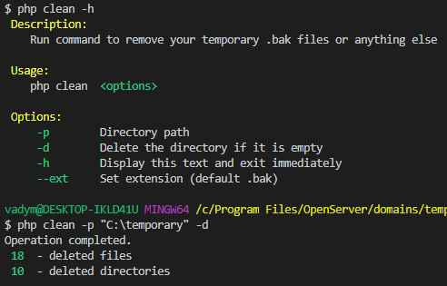

# Temporary Files Cleaner
Temporary Files Cleaner is a simple command that helps with deleting temprary .bak files or anything else.

Requirements

 * PHP >= 7.0

## Installation

 ```git clone git@github.com:everything-now/temp-files-cleaner.git```

## Usage
Run command from the terminal:

 ```php clean <options>```

## Options

*   `-p`        Directory path
*   `-d`        Delete the directory if it is empty
*   ` -h`       Display this text and exit immediately
*   `--ext`     Set extension (default .bak)

## Example



